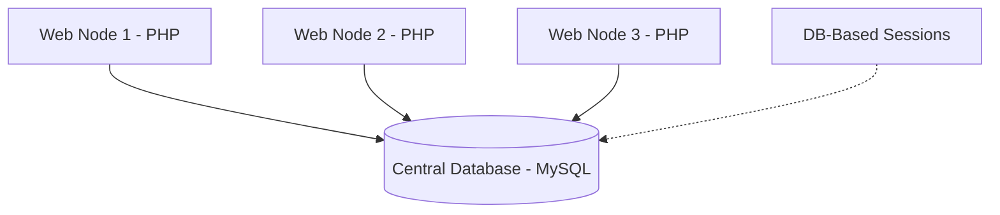

# Distributed System Deployment Guide 🚀

This guide explains how to scale your **Online Exam System** across multiple computers (nodes) in a real-world network.

## 1. Architecture Overview
A distributed system separates concerns. In our setup:
- **Database Node (Server 1)**: Holds the MySQL database and the master records.
- **Web Nodes (Server 2, 3, ...)**: Run the PHP code and serve students/teachers.



## 2. Server-Side Setup (Database PC)
To allow other PCs to connect to your database:

1. **Open MySQL to Network**:
   - Open XAMPP Control Panel > Apache > Config > `httpd-xampp.conf` (if needed) but mainly MySQL.
   - Go to MySQL > Config > `my.ini`.
   - Find `bind-address` and change it to `0.0.0.0` or comment it out.
2. **Grant Remote Permissions**:
   - Open `phpMyAdmin` > User Accounts.
   - Create a user (e.g., `remote_user`) with host `%` (any host).
   - Grant all privileges on `online_exam_system`.
3. **Open Firewall**:
   - Open Windows Firewall > Advanced Settings.
   - Add an **Inbound Rule** for Port `3306` (TCP) to allow MySQL traffic.

## 3. Web Node Setup (Other PCs)
On every other PC running the code:

1. **Update Configuration**:
   - Edit [config.php](file:///C:/xampp/htdocs/oline%20exam/config.php).
   - Change `DB_HOST` from `localhost` to your Database PC's IP:
   ```php
   define('DB_HOST', '192.168.137.1'); 
   ```
2. **Session Consistency**:
   - Because we implemented **DB-based Sessions** in [session_handler.php](file:///C:/xampp/htdocs/oline%20exam/session_handler.php), a student can log in on PC-A and their session will be recognized on PC-B instantly.

## 4. Monitoring & Observability (Academic Concepts)
A professional distributed system must be observable. We have implemented:

1. **Cluster Monitor**: Admins can visit the **Cluster Monitor** from their dashboard.
   - **Heartbeats**: Every PC running the code "checks in" automatically. You can see which PCs are currently online.
   - **Centralized Logging**: Every login, logout, and major action is logged to a single table with the **Node ID** and **IP Address** of the machine where it happened.
2. **Node Transparency**: Each page footer shows exactly which "Node" handled the request, aiding in debugging cluster issues.

## 5. Why this is "Distributed"?
- **Fault Tolerance**: If one web node fails, the others keep working.
- **Scalability**: You can add 100 web nodes to handle thousands of students.
- **Observability**: Centralized logs and node heartbeats provide a "God's eye view" of the entire cluster.
- **Stateless Web Nodes**: Web servers don't store session files locally, making them easy to swap or restart.

## 6. Quick Testing Checklist (How to Verify)
Follow these 3 steps to see the distributed system in action:

1. **Find your IP address**:
   - On your main PC, you confirmed it is: `192.168.137.1`.
2. **Access from a 2nd PC**:
   - Make sure both PCs are on the same Wi-Fi.
   - On the 2nd PC's browser, type: `http://192.168.137.1/oline exam/`
   - Log in as a student or teacher.
3. **Verify in Cluster Monitor**:
   - On your **Main PC**, log in as **Admin**.
   - Go to **Cluster Monitor**.
   - You should see the 2nd PC appear in the "Registered Web Nodes" list with its unique Node ID and IP!

> [!TIP]
> Each PC will automatically generate a different **Node ID** (like `DESKTOP-ABC` vs `LAPTOP-XYZ`). This confirms they are different nodes in the same cluster.

> [!IMPORTANT]
> Always ensure all PCs are on the same local network (LAN) or a VPN for this to work without complex cloud routing.
